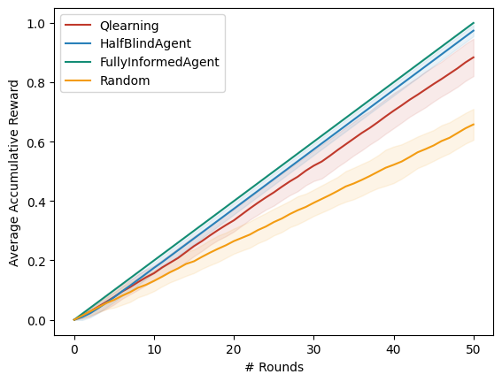

# Playing against nature

  

Código para replicar el trabajo de [Playing against Nature: causal discovery for decision making under uncertainty](https://arxiv.org/pdf/1807.01268.pdf  "Playing against nature")

 
## Instalación y ejecución

Instalar los módulos requeridos para ejecutar los programas.

    pip install -r requisitos.txt
 
 Para ejecutar los experimentos de acuerdo con la configuración experimental del artículo original ejecutar el programa `experiments.py`.

Para cambiar la configuración del modelo y otros parámetros,  los agentes reciben un archivo de configuración
en formato de `json`, con la siguiente estructura.

    {
	    "digrap": [
		    [
			    "variable1",
			    "variable2"
		    ]
		    [
			    "variablei",
			    "variablej"
		    ]
	    ],
	    "cpdtables" : [
		    "variable" : "variablei",
		    "variable_card" : # de valores de la variable,
		    "values": [
			    probvalor1,
			    probvalorn,
		    ]
		    "evidence" : [
			    "padre1",
			    "padren"
		    ]
		    "evidence_card" : [
			    # de valores para padre 1, # de valores padre n
		    ]
	    ]
	    "target": "variabletarget",
	    "nature_variables" : [
		    "variable i no intervenible que la naturaleza modifica"
	    ],
	    "interventions" : [
		    "variables i intervenible
	    ]
	    
    }

Para un ejemplo de como se llena el archivo de configuración ir a `configs/model_parameters.json`.

El programa `experiments.py` ejecuta los cuatro algoritmos y produce una gráfica del desempeño de cada algoritmo y una que compara todos. Los argumentos del programa son

    python experiments.py --experiments # de experimentos --rounds # de rondas por experimento --target-value el valor que se busca tome la variable objetivo --config-file ruta del archivo con la configuración del modelo --log-file nombre del archivo para logs

## Ejemplo de una ejecución

Supongamos un modelo causal con las siguientes variables:

* Tratamiento
* Reacción
* Enfermedad
* Final

Con la estructura causal:

Y con los siguientes parámetros:

| Enfermedad 0 | 0.7 |
|--------------|-----|
| Enfermedad 1 | 0.3 |

| Tratamiento 0 | 0.5 |
|---------------|-----|
| Tratamiento 1 | 0.5 |

| Tratamiento | Tratamiento 0 | Tratamiento 1 |
|-------------|---------------|---------------|
| Reacción 0  | 0.7           | 0.4           |
| Reacción 1  | 0.3           | 0.6           |

| Enfermedad  | Enfermedad 0  | Enfermedad 0  | Enfermedad 0  | Enfermedad 0  | Enfermedad 1  | Enfermedad 1  | Enfermedad 1  | Enfermedad 1  |
|-------------|---------------|---------------|---------------|---------------|---------------|---------------|---------------|---------------|
| Reacción    | Reacción 0    | Reacción 0    | Reacción 1    | Reacción 1    | Reacción 0    | Reacción 0    | Reacción 1    | Reacción 1    |
| Tratamiento | Tratamiento 0 | Tratamiento 1 | Tratamiento 0 | Tratamiento 1 | Tratamiento 0 | Tratamiento 1 | Tratamiento 0 | Tratamiento 1 |
| Final 0     | 0.6           | 0             | 0.8           | 0             | 0.4           | 0             | 0.9           | 0             |
| Final 1     | 0.4           | 1             | 0.2           | 1             | 0.6           | 1             | 0.1           | 1             |

Ejecutando 20 experimentos con 50 rondas cada uno y donde nos interesa que la variable Final tome el valor 1 tenemo 

    python experiments.py --experiments 20 --rounds 50 --target-value 1

Los resultados obtenidos de la recomensa acumulada promedio son

## Cosas por hacer

+ Usar el modelo aproximado para ver que tan consistentes
son las observacione con lo que estoy aprendiendo

+ Generar las tablas aleatorias
+ Iterar para ver si converge
+ Meter al trabajo de los switches
+ Conteo de las veces que veo cosas

# Algoritmo de aprendizaje de la estructura

**Entrada**: Un número *L* de pasos de exploración,orden causal de las variables, lista de aristas inválidas *I*, naturaleza *N*, variable objetivo *Y*, valor deseado de la variable objetivo *y*, variable de intervención *X*, número de rondas de actualización *rounds*.

1. Explorar *L* veces el ambiente actuando sobre las variables de intervención *X* y observar respuestas de la naturaleza. Guardar las observaciones en *O*, |*O*| = *L*.

2. Crear e inicializar tabla de creencias *P*, respetando el orden causal y las aristas inválidas *I*. Cada creencia *pij* denota la probabilidad de conexión entre la variable i y j.

3. Generar un grafo *G* a partir de las creencias *P*.

<!-- 5. Crear modelo *M* con grafo *G* y con parámetros aprendidos a partir de los datos en *O*. -->

4. Para 1, ..., *rounds*:
	+ Crear agente *A* cuya única información es *G*.
	+ El agente *A* toma la decisión de acuerdo con el grafo *G* y con sus creencias.
	+ *N* responde a la acción y envía observación *o = <xi, ..., y>*.
	+ Añadir *o* al búfer de observaciones *O*.
	+ Actualizar creencias *P*.
		+ Para cada pij en *P*
			+ Si la arista <i, j> está en *G*:
				+ Crear modelo *Mij* a partir de *G* y aprender parámetros usando *O*.
				+ Crear modelo *M~ij* a partir de *G - <i,j>* y aprender parámetros usando *O*.
			+ Si la arista <i, j> no está en *G*:
				+ Crear modelo *Mij* a partir de *G + <i,j>* y aprender parámetros usando *O*.
				+ Crear modelo *M~ij* a partir de *G* y aprender parámetros usando *O*.
			+ Calcular probabilidad de la observación *o* en el modelo con la arista i->j:  
				+ *p'ij* <- *P(o|Mij)*
			+ Calcular probabilidad de la observación *o* en el modelo sin la arista i->j:  
				+ *p'~ij* <- *P(o|M~ij)*
			+ Actualizar conexión *pij*:
				+ pij* <- (*pij* * *p'ij*) / (*pij* * *p'ij* + *(1 - pij)* * *p'~ij*)
	+ Generar un grafo *G* a partir de las creencias actualizadas *P*.

			
		
